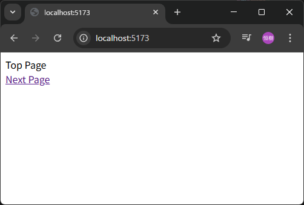
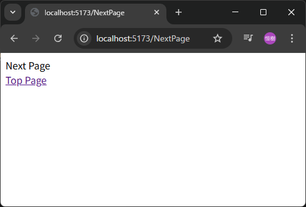
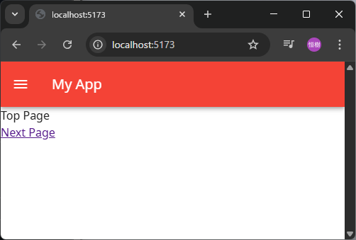

# Vue Base

## 概要

Vue アプリ開発の基盤プロジェクト。  
Vite + TypeScript + Vue.js + Vue Router + Vuetify の構成。  
Vue Router はファイルベースルーティングで使用する。

## 必要なもの

- Node.js 24
- pnpm 10
- VSCode
- VSCode extension: Vue(Official)

## コマンド(スクリプト)

### 依存関係インストール

```sh
pnpm i
```

### 実行

```sh
pnpm dev
```

### ビルド

```sh
pnpm build
```

## 基盤プロジェクト作成手順-1

Vite + TypeScript + Vue.js 実行まで。

### 1. pnpm プロジェクト初期化

```sh
pnpm init
```

### 2. 依存関係追加

```sh
pnpm i -D typescript vite @vitejs/plugin-vue @vue/tsconfig
pnpm i vue
```

### 3. package.json スクリプト設定

修正前

```json
～
  "scripts": {
    "test": "echo \"Error: no test specified\" && exit 1"
  }
～
```

修正後

```json
～
  "scripts": {
    "dev": "vite"
  }
～
```

### 4. ファイル追加

| No. | ファイル            | 概要                         |
| --: | ------------------- | ---------------------------- |
|   1 | src/assets/main.css | Vue アプリ全体に適用する CSS |
|   2 | src/App.vue         | SFC のルートビュー           |
|   3 | src/main.ts         | Vue アプリのエントリポイント |
|   4 | index.html          |                              |
|   5 | tsconfig.json       | TypeScript コンパイル設定    |
|   6 | vite.config.ts      | Vite の設定ファイル          |

#### src/assets/main.css

```css
body {
  font-family: sans-serif;
  font-size: 1em;
}
```

#### src/App.vue

```vue
<script setup lang="ts">
const title: string = 'My Vue App'
</script>

<template>
  <div>{{ title }}</div>
</template>
```

#### src/main.ts

```ts
import './assets/main.css'
import { createApp } from 'vue'
import App from './App.vue'

createApp(App).mount('#app')
```

#### index.html

```html
<!DOCTYPE html>
<html lang="ja">
  <head>
    <meta charset="UTF-8" />
    <link rel="icon" href="data:;base64,=" />
    <meta name="viewport" content="width=device-width, initial-scale=1" />
    <title></title>
  </head>
  <body>
    <div id="app"></div>
    <script type="module" src="/src/main.ts"></script>
  </body>
</html>
```

#### tsconfig.json

```json
{
  "compilerOptions": {
    "tsBuildInfoFile": "./tmp/tsconfig.tsbuildinfo"
  },
  "extends": "@vue/tsconfig/tsconfig.dom.json"
}
```

#### vite.config.ts

```ts
import { defineConfig } from 'vite'
import vue from '@vitejs/plugin-vue'

export default defineConfig({
  plugins: [vue()],
})
```

### 5. 実行

```sh
pnpm dev
```

##### [ 1-5.png ]


## 基盤プロジェクト作成手順-2

Vite + TypeScript + Vue.js ビルドまで。

### 1. 依存関係追加

```sh
pnpm i -D vue-tsc npm-run-all2
```

### 2. package.json スクリプト設定

変更前

```json
～
  "scripts": {
    "dev": "vite"
  }
～
```

変更後

```json
～
  "scripts": {
    "dev": "vite",
    "build": "run-p type-check build-only",
    "build-only": "vite build",
    "type-check": "vue-tsc --build"
  }
～
```

### 3. ビルド

./dist にビルドされる。

```sh
pnpm build
```

## 基盤プロジェクト作成手順-3

Vue Router まで。

### 1. 依存関係追加

```sh
pnpm i -D unplugin-vue-router
pnpm i vue-router
```

### 2. ファイル修正

| No. | ファイル       | 概要                                                     |
| --: | -------------- | -------------------------------------------------------- |
|   1 | src/main.ts    | Vue にルーターを追加                                     |
|   2 | src/App.vue    | ルーターが返すビューを参照する                           |
|   3 | tsconfig.json  | 型定義を追加                                             |
|   4 | vite.config.ts | src/pages ファイルからルート定義を自動生成する設定を追加 |

#### src/main.ts

```ts
import './assets/main.css'
import { createApp } from 'vue'
import { createRouter, createWebHistory } from 'vue-router' // 追加
import { routes } from 'vue-router/auto-routes' // 追加
import App from './App.vue'

// 追加
const router = createRouter({
  history: createWebHistory(),
  routes,
})

createApp(App)
  .use(router) // 追加
  .mount('#app')
```

#### src/App.vue

##### 修正前

```vue
<script setup lang="ts">
const title: string = 'My Vue App'
</script>

<template>
  <div>{{ title }}</div>
</template>
```

##### 修正後

```vue
<template>
  <RouterView />
</template>
```

#### tsconfig.json

##### 修正前

```json
{
  "compilerOptions": {
    "tsBuildInfoFile": "./tmp/tsconfig.tsbuildinfo"
  },
  "extends": "@vue/tsconfig/tsconfig.dom.json"
}
```

##### 修正後

```json
{
  "compilerOptions": {
    "tsBuildInfoFile": "./tmp/tsconfig.tsbuildinfo",
    "types": ["unplugin-vue-router/client"]
  },
  "extends": "@vue/tsconfig/tsconfig.dom.json",
  "include": ["src/**/*", "types/**/*"]
}
```

#### vite.config.ts

```ts
import { defineConfig } from 'vite'
import vue from '@vitejs/plugin-vue'
import VueRouter from 'unplugin-vue-router/vite' // 追加

export default defineConfig({
  plugins: [
    vue(),
    // 追加
    VueRouter({
      routesFolder: 'src/pages',
      dts: './types/typed-router.d.ts',
    }),
  ],
})
```

### 3. ファイル追加

| No. | ファイル               | 概要         |
| --: | ---------------------- | ------------ |
|   1 | src/pages/index.vue    | トップページ |
|   2 | src/pages/NextPage.vue | 次のページ   |

#### src/pages/index.vue

```vue
<script setup lang="ts">
const title = 'Top Page'
</script>

<template>
  <div>{{ title }}</div>
  <router-link to="/NextPage">Next Page</router-link>
</template>
```

#### src/pages/NextPage.vue

```vue
<script setup lang="ts">
const title = 'Next Page'
</script>

<template>
  <div>{{ title }}</div>
  <router-link to="/">Top Page</router-link>
</template>
```

### 4. 実行

```sh
pnpm dev
```

##### [ 3-4-1.png, 3-4-2.png ]





### 5. ビルド

```sh
pnpm build
```

## 基盤プロジェクト作成手順-4

Vuetify 追加。

### 1. 依存関係追加

```sh
pnpm i vuetify @mdi/font
```

### 2. ファイル修正

| No. | ファイル    | 概要                         |
| --: | ----------- | ---------------------------- |
|   1 | src/App.vue | VApp,VAppBar,VAppView を追加 |
|   2 | src/main.ts | Vue に Vuetify を追加        |

#### src/App.vue

##### 変更前

```vue
<template>
  <RouterView />
</template>
```

##### 変更後

```vue
<template>
  <VApp>
    <VAppBar color="red" title="My App">
      <template #prepend>
        <VAppBarNavIcon />
      </template>
    </VAppBar>
    <VMain>
      <RouterView />
    </VMain>
  </VApp>
</template>
```

#### src/main.ts

```ts
import './assets/main.css'
import { createApp } from 'vue'
// Vue Router // 追加
import { createRouter, createWebHistory } from 'vue-router'
import { routes } from 'vue-router/auto-routes'

// 追加
// Vuetify
import 'vuetify/styles'
import { createVuetify } from 'vuetify'
import * as components from 'vuetify/components'
import * as directives from 'vuetify/directives'
import '@mdi/font/css/materialdesignicons.css'

import App from './App.vue'

// Vue Router // 追加
const router = createRouter({
  history: createWebHistory(),
  routes,
})

// 追加
// Vuetify
const vuetify = createVuetify({
  components,
  directives,
})

createApp(App)
  .use(router)
  .use(vuetify) // 追加
  .mount('#app')
```

### 3. 実行

```sh
pnpm dev
```

##### [ 4-3.png ]


## 基盤プロジェクト作成手順-5

マルチプラットフォームでフォントを統一するために、Noto Sans フォントを使用する。

### 1. package.json スクリプト設定

### 2. ファイル追加

| No. | ファイル                       | 概要                                                                                 |
| --: | ------------------------------ | ------------------------------------------------------------------------------------ |
|   1 | scripts/install-fonts.ts       | 依存関係インストール、実行、ビルド時に呼び出されるフォント・インストール・スクリプト |
|   2 | src/assets/fonts/noto-sans.css | Noto Sans フォントの CSS                                                             |

#### scripts/install-fonts.ts

```ts
import { existsSync, mkdirSync } from 'fs'
import { join, dirname } from 'path'
import { execSync } from 'child_process'

const FONTS_DIR = join(process.cwd(), 'src', 'assets', 'fonts')
const NOTO_SANS_DIR = join(FONTS_DIR, 'noto-sans')
const FONT_FILE = join(NOTO_SANS_DIR, 'NotoSans-Regular.ttf')
const FONT_URL =
  'https://github.com/googlefonts/noto-fonts/raw/main/hinted/ttf/NotoSans/NotoSans-Regular.ttf'

async function installNotoSansFont(): Promise<void> {
  if (existsSync(FONT_FILE)) {
    console.log('✓ Noto Sans font already installed.')
    return
  }

  console.log('📦 Installing Noto Sans font...')

  try {
    // Create directory if it doesn't exist
    if (!existsSync(NOTO_SANS_DIR)) {
      mkdirSync(NOTO_SANS_DIR, { recursive: true })
    }

    // Download font using curl with proper options
    const command = `curl -L -A "Mozilla/5.0" -o "${FONT_FILE}" "${FONT_URL}"`
    execSync(command, {
      stdio: 'inherit',
      cwd: process.cwd(),
    })

    // Verify download
    if (!existsSync(FONT_FILE)) {
      throw new Error('Font file was not created')
    }

    console.log('✓ Noto Sans font installed successfully.')
  } catch (error) {
    console.error(
      '❌ Failed to install Noto Sans font:',
      error instanceof Error ? error.message : error
    )
    process.exit(1)
  }
}

// Execute the function
installNotoSansFont().catch(console.error)
```

#### src/assets/fonts/noto-sans.css

```css
@font-face {
  font-family: 'Noto Sans';
  src: url('./noto-sans/NotoSans-Regular.ttf') format('truetype');
  font-weight: 400;
  font-style: normal;
  font-display: swap;
}
```

### 3. ファイル修正

| No. | ファイル            | 概要                         |
| --: | ------------------- | ---------------------------- |
|   1 | src/assets/main.css | Noto Sans フォントを使用する |

#### src/assets/main.css

##### 修正前

```css
body {
  font-family: sans-serif;
  font-size: 1em;
}
```

##### 修正後

```css
@import './fonts/noto-sans.css';

body {
  font-family: 'Noto Sans';
  font-size: 1em;
}
```

### 4. 実行

```sh
pnpm dev
```

##### [ 5-4.png ]



## 基盤プロジェクト作成手順-6

コードの管理性向上と安全性向上。

### 1. ファイル追加

| No. | ファイル              | 概要                                         |
| --: | --------------------- | -------------------------------------------- |
|   1 | .vscode/settings.json | エクスプローラーのファイル・ネスト表示を設定 |
|   2 | .gitignore            | Git 管理除外を設定                           |

#### .vscode/settings.json

```json
{
  "explorer.fileNesting.enabled": true,
  "explorer.fileNesting.patterns": {
    "tsconfig.json": "tsconfig.*.json",
    "package.json": "package-lock.json, pnpm-*"
  }
}
```

#### .gitignore

```
# Dependencies
node_modules/

# Build outputs
dist/

# Development cache and tmp files
tmp/

# Environment files
.env

# IDE files
.vscode/*
!.vscode/extensions.json
!.vscode/settings.json
.idea/
*.swp
*.swo

# OS generated files
.DS_Store
._*
Thumbs.db

# Coverage directory used by tools like istanbul
coverage/
*.lcov
.idea
*.suo
*.ntvs*
*.njsproj
*.sln
*.sw?
```

### 2. ファイル修正

| No. | ファイル      | 概要                            |
| --: | ------------- | ------------------------------- |
|   1 | tsconfig.json | TypeScript の厳格チェックを強化 |

#### tsconfig.json

##### 修正前

```json
{
  "compilerOptions": {
    "tsBuildInfoFile": "./tmp/tsconfig.tsbuildinfo",
    "types": ["unplugin-vue-router/client"]
  },
  "extends": "@vue/tsconfig/tsconfig.dom.json",
  "include": ["src/**/*", "types/**/*"]
}
```

##### 修正後

```json
{
  "compilerOptions": {
    "strict": true,
    "noUnusedLocals": true,
    "noUnusedParameters": true,
    "noImplicitReturns": true,
    "noFallthroughCasesInSwitch": true,
    "exactOptionalPropertyTypes": true,
    "tsBuildInfoFile": "./tmp/tsconfig.tsbuildinfo",
    "types": ["unplugin-vue-router/client"]
  },
  "extends": "@vue/tsconfig/tsconfig.dom.json",
  "include": ["src/**/*", "types/**/*"]
}
```
