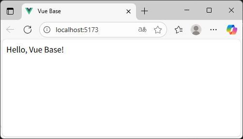

[README TOP](./README.md)

# Step1 : Init, Vite & TypeScript

Instructions for initial project setup, adding and configuring Vite and TypeScript.

## 1. Initialize project

```sh
pnpm init
```

## 2. Add Vite & TypeScript

```sh
pnpm add -D vite typescript
```

## 3. Edit package.json

Before

```json
{
  "name": "foo",
  "version": "1.0.0",
  "description": "",
  "main": "index.js",
  "scripts": {
    "test": "echo \"Error: no test specified\" && exit 1"
  },
  "keywords": [],
  "author": "",
  "license": "ISC",
  "packageManager": "pnpm@10.14.0",
  "devDependencies": {
    "typescript": "^5.9.2",
    "vite": "^7.1.2"
  }
}
```

After

```json
{
  "name": "foo",
  "version": "0.0.1",
  "scripts": {
    "build": "vite build",
    "dev": "vite"
  },
  "packageManager": "pnpm@10.14.0",
  "devDependencies": {
    "typescript": "^5.9.2",
    "vite": "^7.1.2"
  }
}
```

## 4. Add files

| No. | File           | Description                                     |
| --: | -------------- | ----------------------------------------------- |
|   1 | index.html     | Sample HTML file.                               |
|   2 | src/main.ts    | Sample TS file.                                 |
|   3 | vite.config.ts | Setting of Vite. Support for deploy to sub dir. |

### index.html

```html
<!DOCTYPE html>
<html lang="ja">
  <head>
    <meta charset="UTF-8" />
    <link rel="icon" href="data:;base64,=" />
    <meta name="viewport" content="width=device-width, initial-scale=1" />
    <title></title>
  </head>
  <body>
    <div id="app"></div>
    <script type="module" src="/src/main.ts"></script>
  </body>
</html>
```

### src/main.ts

```ts
const message: string = 'Hello, Vue Base!'
const messageElement: HTMLElement | null = document.getElementById('app')
if (messageElement) {
  messageElement.textContent = message
}
```

### vite.config.ts

```ts
import { defineConfig } from 'vite'

export default defineConfig({
  base: './',
})
```

## 5. Start vite server

```sh
pnpm dev
```



## 6. Stop vite server & build

Input Ctrl+C for stop vite server.  
build command output modules to dist dir.

```sh
pnmm build
```
