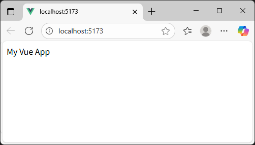

[README TOP](./README.md)

# Step2 : Vue.js

Instruction for setup Vue.js after step1.

## 1. Add Vue.js, types & tools

```sh
pnpm add vue
pnpm add -D @vitejs/plugin-vue @vue/tsconfig vue-tsc npm-run-all2
```

## 2. Edit package.json

Before

```json
{
  "name": "foo",
  "version": "0.0.1",
  "scripts": {
    "build": "vite build",
    "dev": "vite"
  },
  "packageManager": "pnpm@10.14.0",
  "devDependencies": {
    "@vitejs/plugin-vue": "^6.0.1",
    "@vue/tsconfig": "^0.8.1",
    "npm-run-all2": "^8.0.4",
    "typescript": "^5.9.2",
    "vite": "^7.1.2",
    "vue-tsc": "^3.1.2"
  },
  "dependencies": {
    "vue": "^3.5.22"
  }
}
```

After

Edit scripts.

```json
{
  "name": "foo",
  "version": "0.0.1",
  "scripts": {
    "build": "run-p type-check build-only",
    "build-only": "vite build",
    "dev": "vite",
    "type-check": "vue-tsc --build"
  },
  "packageManager": "pnpm@10.14.0",
  "devDependencies": {
    "@vitejs/plugin-vue": "^6.0.1",
    "@vue/tsconfig": "^0.8.1",
    "npm-run-all2": "^8.0.4",
    "typescript": "^5.9.2",
    "vite": "^7.1.2",
    "vue-tsc": "^3.1.2"
  },
  "dependencies": {
    "vue": "^3.5.22"
  }
}
```

## 3. Add & edit files

| No. | Add/Edit | File                | Description                            |
| --: | -------- | ------------------- | -------------------------------------- |
|   1 | Add      | src/assets/main.css | CSS to apply to the entire vue app.    |
|   2 | Add      | src/App.vue         | Root vue file.                         |
|   3 | Edit     | src/main.ts         | Change to the entry point for vue app. |
|   4 | Add      | tsconfig.json       | Setting for TypeScript transpile.      |
|   5 | Edit     | vite.config.ts      | Add support for vue file.              |

### src/assets/main.css

```css
body {
  font-family: sans-serif;
  font-size: 1em;
}
```

### src/App.vue

```ts
<script setup lang="ts">
const title: string = 'My Vue App'
</script>

<template>
  <div>{{ title }}</div>
</template>
```

### src/main.ts

Before

```ts
const message: string = 'Hello, Vue Base!'
const messageElement: HTMLElement | null = document.getElementById('app')
if (messageElement) {
  messageElement.textContent = message
}
```

After

```ts
import './assets/main.css'
import { createApp } from 'vue'
import App from './App.vue'

createApp(App).mount('#app')
```

### tsconfig.json

```json
{
  "compilerOptions": {
    "tsBuildInfoFile": "./tmp/tsconfig.tsbuildinfo"
  },
  "extends": "@vue/tsconfig/tsconfig.dom.json"
}
```

### vite.config.ts

Before

```ts
import { defineConfig } from 'vite'

export default defineConfig({
  base: './',
})
```

After

```ts
import { defineConfig } from 'vite'
import vue from '@vitejs/plugin-vue'

export default defineConfig({
  plugins: [vue()],
  base: './',
})
```

## 4. Start vite server

```sh
pnpm dev
```



## 5. Stop vite server & build

Input Ctrl+C for stop vite server.  
build command output modules to dist dir.

```sh
pnmm build
```
