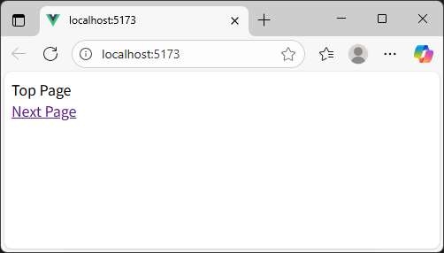
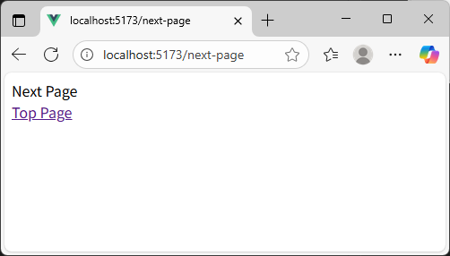

[README TOP](./README.md)

# Step3 : Vue Router

Instruction for setup Vue Router after step2.

## 1. Add Vue Router

```sh
pnpm add vue-router
pnpm add -D unplugin-vue-router
```

## 2. Add & Edit files

| No. | Add/Edit | File                   | Description                                 |
| --: | -------- | ---------------------- | ------------------------------------------- |
|   1 | Edit     | tsconfig.json          | Add type definition of router.              |
|   2 | Edit     | vite.config.ts         | Add automatic type definition of src/pages. |
|   3 | Add      | src/env.d.ts           | Tell the type of environment variables.     |
|   4 | Edit     | src/main.ts            | Add router to vue plugins.                  |
|   5 | Edit     | src/App.vue            | Show vue component that returned by router. |
|   6 | Add      | src/pages/index.vue    | Sample top page.                            |
|   7 | Add      | src/pages/NextPage.vue | Sample next page.                           |

### tsconfig.json

Before

```json
{
  "compilerOptions": {
    "tsBuildInfoFile": "./tmp/tsconfig.tsbuildinfo"
  },
  "extends": "@vue/tsconfig/tsconfig.dom.json"
}
```

After

```json
{
  "compilerOptions": {
    "tsBuildInfoFile": "./tmp/tsconfig.tsbuildinfo",
    "types": ["unplugin-vue-router/client"]
  },
  "extends": "@vue/tsconfig/tsconfig.dom.json",
  "include": ["src/**/*", "types/**/*"]
}
```

### vite.config.ts

Before

```ts
import { defineConfig } from 'vite'
import vue from '@vitejs/plugin-vue'

export default defineConfig({
  plugins: [vue()],
  base: './',
})
```

After

```ts
import { defineConfig } from 'vite'
import vue from '@vitejs/plugin-vue'
import VueRouter from 'unplugin-vue-router/vite'

export default defineConfig({
  plugins: [
    vue(),
    VueRouter({
      routesFolder: 'src/pages',
      dts: './types/typed-router.d.ts',
    }),
  ],
  base: './',
})
```

### src/env.d.ts

```ts
/// <reference types="vite/client" />
```

### src/main.ts

Before

```ts
import './assets/main.css'
import { createApp } from 'vue'
import App from './App.vue'

createApp(App).mount('#app')
```

After

```ts
import './assets/main.css'
import { createApp } from 'vue'
import { createRouter, createWebHistory } from 'vue-router'
import { routes } from 'vue-router/auto-routes'
import App from './App.vue'

const router = createRouter({
  history: createWebHistory(import.meta.env.BASE_URL),
  routes,
})

createApp(App).use(router).mount('#app')
```

### src/App.vue

Before

```ts
<script setup lang="ts">
const title: string = 'My Vue App'
</script>

<template>
  <div>{{ title }}</div>
</template>
```

After

```html
<template>
  <RouterView />
</template>
```

### src/pages/index.vue

```ts
<script setup lang="ts">
const title = 'Top Page'
</script>

<template>
  <div>{{ title }}</div>
  <router-link to="/next-page">Next Page</router-link>
</template>
```

### src/pages/next-page.vue

```ts
<script setup lang="ts">
const title = 'Next Page'
</script>

<template>
  <div>{{ title }}</div>
  <router-link to="/">Top Page</router-link>
</template>
```

## 3. Start vite server

```sh
pnpm dev
```





## 4. Stop vite server & build

Input Ctrl+C for stop vite server.  
Build command output modules to dist dir.  
If you watn to deploy to a directory other than /, you neet to set the base property in vite.config.ts before build.

e.g. case deploy to /myapp

vite.config.ts

```ts
...
  base: '/myapp',
...
```

```sh
pnmm build
```
