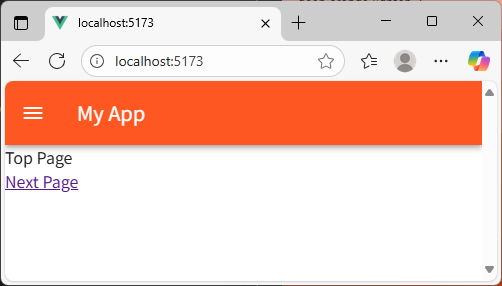
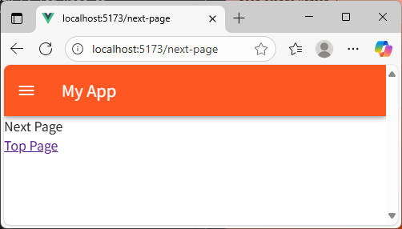

[README TOP](./README.md)

# Step4 : Vuetify

Instruction for setup Vuetify after step3.

## 1. Add Vuetify

```sh
pnpm add vuetify @mdi/font
```

## 2. Edit files

| No. | File        | Description                    |
| --: | ----------- | ------------------------------ |
|   1 | src/main.ts | Add Vuetify to vue plugin.     |
|   2 | src/App.vue | Add VApp,VAppBar & VMain vues. |

### src/main.ts

Before

```ts
import './assets/main.css'
import { createApp } from 'vue'
import { createRouter, createWebHistory } from 'vue-router'
import { routes } from 'vue-router/auto-routes'
import App from './App.vue'

const router = createRouter({
  history: createWebHistory(import.meta.env.BASE_URL),
  routes,
})

createApp(App).use(router).mount('#app')
```

After

```ts
import './assets/main.css'
import { createApp } from 'vue'
import { createRouter, createWebHistory } from 'vue-router'
import { routes } from 'vue-router/auto-routes'

// Vuetify
import 'vuetify/styles'
import { createVuetify } from 'vuetify'
import * as components from 'vuetify/components'
import * as directives from 'vuetify/directives'
import '@mdi/font/css/materialdesignicons.css'

import App from './App.vue'

const router = createRouter({
  history: createWebHistory(import.meta.env.BASE_URL),
  routes,
})

// Vuetify
const vuetify = createVuetify({
  components,
  directives,
})

createApp(App).use(router).use(vuetify).mount('#app')
```

### src/App.vue

Before

```ts
<template>
  <RouterView />
</template>
```

After

```ts
<template>
  <VApp>
    <VAppBar color="deep-orange" title="My App">
      <template #prepend>
        <VAppBarNavIcon />
      </template>
    </VAppBar>
    <VMain>
      <RouterView />
    </VMain>
  </VApp>
</template>
```

## 3. Start vite server

```sh
pnpm dev
```





## 4. Stop vite server & build

Input Ctrl+C for stop vite server.  
Build command output modules to dist dir.  
If you watn to deploy to a directory other than /, you neet to set the base property in vite.config.ts before build.

e.g. case deploy to /myapp

vite.config.ts

```ts
...
  base: '/myapp',
...
```

Build

```sh
pnmm build
```
